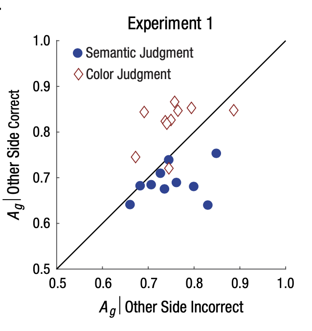

<!-- Reproducibility reports should all use this template to standardize reporting across projects. These reports will be public supplementary materials that accompany the summary report(s) of the aggregate results. -->

## Introduction

### Description of paper:

This paper describes two experiments that were conducted in which researchers used eye tracking and rapid-serial-visual-presentation of stimuli to determine if the human visual parallel architecture allows for simultaneous processing of two words at once or if word recognition is constrained to serial processing. In Experiment 1, participants were asked to look at fixation cross in the center of the screen while pairs of words on either side of the cross flashed in rapid succession. At the end of each trial, participants were asked to identity if a target word from a pre-identified semantic category and/or if a target colored text was present on an indicated side of the fixation cross. The researchers then looked at the average accuracy for each participant and found that the data supported a serial processing model for the word recognition task but a parallel processing model for color recognition. 

**Clarify key analysis of interest here**  
The authors computed the area under the receiver-operating-characteristic (ROC) curve, known as Green’s area or *Ag* as a bias-free measure of accuracy.They then coded all dual-task responses by whether the response to the other side on the same trial was correct or incorrect and then computed *Ag* for both sets of trials. Additionally, the authors reported mean accuracy, standard error of mean, t and p values, and confidence intervals for each task.

### Justification for choice of study

This paper uses eye tracking data to help measure word processing ability. The research question and methodology of this paper are very relevant the the research I will be conducting as a PhD student. My research focuses on the neural processing of stimuli associated with reading (primarily within the visual and auditory systems). Due to the in-person nature of the original project and the present state of the world, I will not be able to collect my own data for this project. I will instead be using the raw data from the original paper, which is publicly available on Open Science Framework, to reproduce the results found in this paper.This will be useful in helping me become familiar with with eye tracking data along with developing a workflow for processing such data. I will also gain experience working through the challenges associated with reproducing experimental results and statistical analysis. This paper describes 2 experiments. I will be reproducing the results for Experiment #1.

### Anticipated challenges

I anticipate some challenges processing and analyzing the data as I have no prior experience working with eye-tracker data. I also do not have extensive prior knowledge of R or statistics so I anticipate some difficulty analyzing data as I am learning as I go.

### Links

Project repository: https://github.com/psych251/white_2018

Original paper: https://github.com/psych251/white_2018/tree/master/original_paper

Open Science Framework: https://osf.io/ewr45 


## Methods

### Description of the steps required to reproduce the results

To reproduce the findings of the original paper, I will
  1. Download the raw data and supplemental materials for Experiment 1 from Open Science Framework
  2. Combine individual participant data into 1 data frame
  3. Prepare the data for processing by filtering and excluding data and creating needed variables for analysis 
  4. Compute dual-task accuracy (*Ag*) for each participant, for each side of fixation, for each task
    1. Compute Hit rates and False Positive rates from reported ratings to compute points for the ROC curve
    2. Calculate area under each ROC curve
  5. Plot dual-task accuracy of of responses correct on other side against responses incorrect on other side
  6. Calculate standard error of mean
  7. Calculate mean accuracy
  8. Calculate t value
  9. Calculate p value
  10. Calculate confidence interval
  

### Differences from original study

The only distinct anticipated difference in this paper from the original study is that the original authors used MatLab to run and analyze the experiment whereas I will be using R. I anticipate that there there may be some minor adjustments made however I am unfamiliar with MatLab and therefore am unable to accurately address if there are any key differences in functionality between the two programs. 


## Results

### Data preparation

Data preparation following the analysis plan.
	
```{r}
### Data Preparation

#### Load Relevant Libraries and Functions
library(tidyverse)
library(ROSE)
library(dplyr)
library(ROCR)
library(DescTools)
library(ggplot2)
library(plotrix)

#### Import data
# set your path to the directory where your data is stored

mypath = "~/Documents/Stanford/Courses/PSYCH_251/white_2018/data"
setwd(mypath)

# combine individual subject data into a single master data file
data_ls = list.files(path=mypath, pattern="*.txt") 
txt_files_df <- lapply(data_ls, function(x) {read.delim(file = x, header = T, sep ="")})
data <- do.call("rbind", lapply(txt_files_df, as.data.frame))

#### Data exclusion / filtering
data <- data %>%
  filter(excludeBlock_BadDifficulty!=1,
         fixBreak!=1,
         nResps == 2)

#### Prepare data for analysis - create columns etc.
ROC_data <- subset(data, select=c(blockNum, trial, subjectNum, targSide, whichTask, reportedRating, respCorrect, targPres))

# create other side correct column
otherSideCorrect = vector(mode = "integer", length = nrow(ROC_data))
for (i in seq(1, nrow(ROC_data) - 1, by=2)) {
  if (ROC_data[i,]$respCorrect == 1) {
    otherSideCorrect[i+1] = 1
    }
  if (ROC_data[i+1,]$respCorrect == 1) {
    otherSideCorrect[i] = 1
    }
  }
ROC_data = cbind(ROC_data, otherSideCorrect)

# convert ratings to a 1-4 scale
for (i in seq(1, length(ROC_data$reportedRating))) {
  if (ROC_data$reportedRating[i] > 0) {
    ROC_data$reportedRating[i] = ROC_data$reportedRating[i] + 2
  }
  if (ROC_data$reportedRating[i] < 0) {
    ROC_data$reportedRating[i] = ROC_data$reportedRating[i] + 3
  }
}
# replace number with task name
for (task in seq(1, length(ROC_data$whichTask))) {
  if (ROC_data$whichTask[task] == 1) {
    ROC_data$whichTask[task] = "Semantic"
  }
  if (ROC_data$whichTask[task] == 2) {
    ROC_data$whichTask[task] = "Color"
  }
}
```
### Key analysis

The analyses as specified in the analysis plan. 
```{r}

nResponses = unique(ROC_data$reportedRating)

# define function to calculate points for ROC curve
ROC_points = function(dataset){
  hit_rates = c(0,0,0,0,0)
  false_rates = c(0,0,0,0,0)
  
  for (n in seq(0, length(nResponses)+1)){
    Total_TP = 0
    Total_TA = 0
    Total_TPcorrect = 0
    Total_TAincorrect = 0
    for (r in seq(1,nrow(dataset))){
      if (dataset$targPres[r] == 1){
        Total_TP = Total_TP + 1
        if (dataset$reportedRating[r] >= n){
          Total_TPcorrect = Total_TPcorrect + 1
        }
      }
      if (dataset$targPres[r] == 0){
        Total_TA = Total_TA + 1
        if (dataset$reportedRating[r] >= n){
          Total_TAincorrect = Total_TAincorrect + 1
        }
      }
    }
    hit_rate = Total_TPcorrect/Total_TP
    false_rate = Total_TAincorrect/Total_TA
  
    hit_rates[n] = hit_rate
    false_rates[n] = false_rate
    
  }
  return(list(hit_rates,false_rates))
}


# Compute and compile Ag data
df_plot = data.frame(X = double(), Y=double(), Task = character())

for (n in seq(1,10)) {
  
  semX = AUC(ROC_points(filter(ROC_data, subjectNum == n,
         whichTask == "Semantic",
         otherSideCorrect == 0))[[2]],
         ROC_points(filter(ROC_data, subjectNum == n,
         whichTask == "Semantic",
         otherSideCorrect == 0))[[1]])
  
  semY = AUC(ROC_points(filter(ROC_data, subjectNum == n,
         whichTask == "Semantic",
         otherSideCorrect == 1))[[2]],
         ROC_points(filter(ROC_data, subjectNum == n,
         whichTask == "Semantic",
         otherSideCorrect == 1))[[1]])
  
  task = "Semantic"
  
  df_plot = rbind(df_plot, c(semX, semY, task))
  
  colrX = AUC(ROC_points(filter(ROC_data, subjectNum == n,
         whichTask == "Color",
         otherSideCorrect == 0))[[2]],
         ROC_points(filter(ROC_data, subjectNum == n,
         whichTask == "Color",
         otherSideCorrect == 0))[[1]])
  
  colrY = AUC(ROC_points(filter(ROC_data, subjectNum == n,
         whichTask == "Color",
         otherSideCorrect == 1))[[2]],
         ROC_points(filter(ROC_data, subjectNum == n,
         whichTask == "Color",
         otherSideCorrect == 1))[[1]])
  
  task = "Color"
  
  df_plot = rbind(df_plot, c(colrX, colrY, task))
  
}

# Rename weird column names
df_plot = rename(df_plot,
  X = X.0.662072072072072.,
  Y = X.0.639321493624772.,
  Task = X.Semantic.
  )

# Plot the results
ggplot(data = df_plot,
       mapping = aes(x = as.numeric(X),
                     y = as.numeric(Y),
                     color = Task))+
  geom_point(size = 2.5) +
  expand_limits(x=c(0.5, 1.0), y=c(0.5, 1.0))+
  geom_abline(intercept = 0, slope = 1)+
  labs(title ="Experiment 1 - Figure 3A Reproduction", x = expression(italic(A[g]) ~ " | Other Side Incorrect"), y =  expression(italic(A[g]) ~ "| Other Side Correct"))+
  coord_fixed()+
  theme(panel.background = element_rect(fill = 'white'),
          panel.grid.major = element_line(colour = NULL),
          panel.grid.minor = element_line(colour = NULL),
          axis.line = element_line(colour = "black"),
          text = element_text(size = 18),
          legend.key=element_rect(fill="white"))+
  scale_color_hue(labels = c("Color Judgement", "Semantic Judgement"))
  
```


The plot above is my seemingly successful reduction of Figure 3A from the paper. See below for the plot from the original paper for comparison.


 

In addition to the above plot, the authors also found the following:
"For semantic judgments in Experiment 1, accuracy was on average .06 Ag units (SEM = .02) lower when the other side’s response was correct than incorrect, t(9) = 3.31, p = .009, 95% CI = [.03, .11]" (page 1068).
"For color judgments, the effect was exactly opposite: In Experiment 1, accuracy was on average .07 Ag units (SEM = .02) higher when the other side’s response was correct than incorrect, t(9) = 3.60, p = .006, 95% CI = [.03, .10]" (page 1068).
See below for reproduced findings.
```{r}
df_calc = df_plot %>%
  mutate(Ag_diff = as.numeric(X)-as.numeric(Y))


df_calcS = filter(df_calc, Task=="Semantic")

std.error(df_calcS$Ag_diff)
t.test(df_calcS$Ag_diff)


df_calcC = filter(df_calc, Task=="Color")

std.error(df_calcC$Ag_diff)
t.test(df_calcC$Ag_diff)

```

## Discussion

### Summary of Reproduction Attempt
The original authors found that mean accuracy on the color judgment task was higher when the other side's response was correct whereas the opposite were true for the semantic judgment task and mean accuracy was higher when the other side's response was incorrect. With these findings the authors concluded that a serial bottleneck does exist when processing semantic data but that other stimuli (such as colors) can be accurately processed and identified through parallel processing. While I did not have the exact points for the graph, I feel I was accurately able to reproduce Figure 3A. My reproduced findings appeared the same and thus supported the authors claim about serial processing of semantic information. 

I also calculated the mean accuracy for both tasks among all participants along with the Standard error of mean, the t score, p value, and the 95% confidence intervals reported in the paper. I saw slight variation in the the confidence intervals for both tasks along with slight variations in the t and p values for the color judgment task. That being said, these variations were small and had no effect on the significance of the finding. Values were so close that I assume the differences occurred due to rounding differences between my calculations and the original authors' calculations. 


### Commentary
Overall, I found the findings of this study to be very reproducible. The paper itself was missing information about how to run the analysis, however the authors provided information for the paper’s OSF listing where supplemental materials, all the raw, unedited data, and analysis code were open to the public. The supplemental materials explained the analysis plan in much more detail, the data was clean, and the authors provided a naming key so others could easily identify the variables in the data. The MatLab analysis code was also provided however, I was instructed not to look at this code during the duration of this project. I suspect if I had looked at this code (and been able to understand it) that I could have very likely reproduced the exact findings listed in the paper without the slight variations I found. Overall, the materials were all very well organized and the open science practices demonstrated by the original authors made the reproduction of the study findings possible. Additionally, due to the open science practices demonstrated by the original authors,  I had no need contact the authors for information in order to complete this project. That being said, the first author was aware that I was attempting a reproduction and had no objections.
